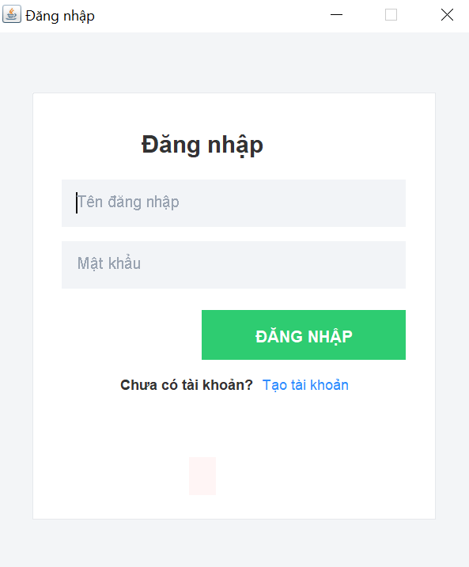
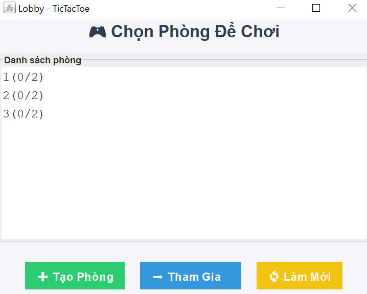
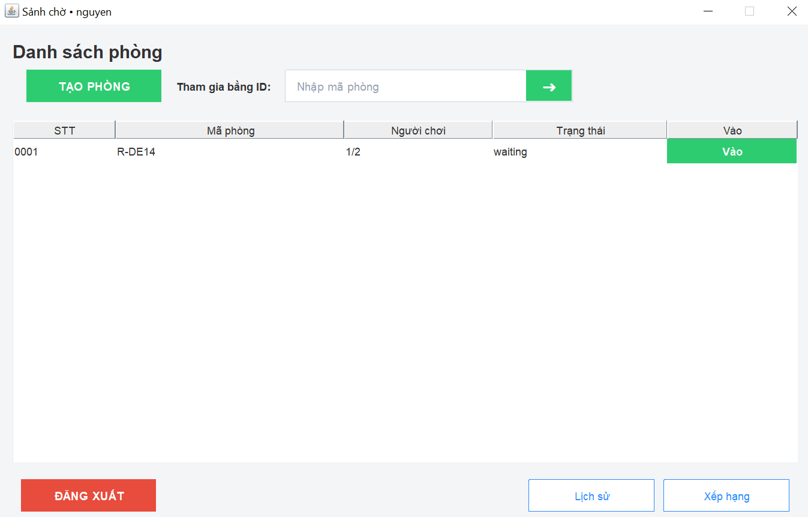
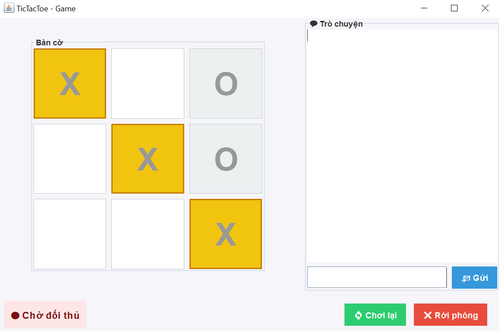
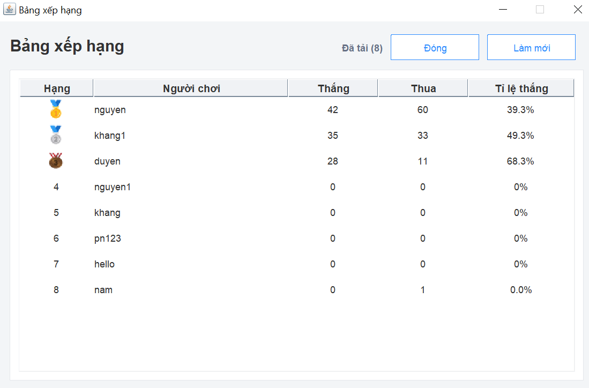
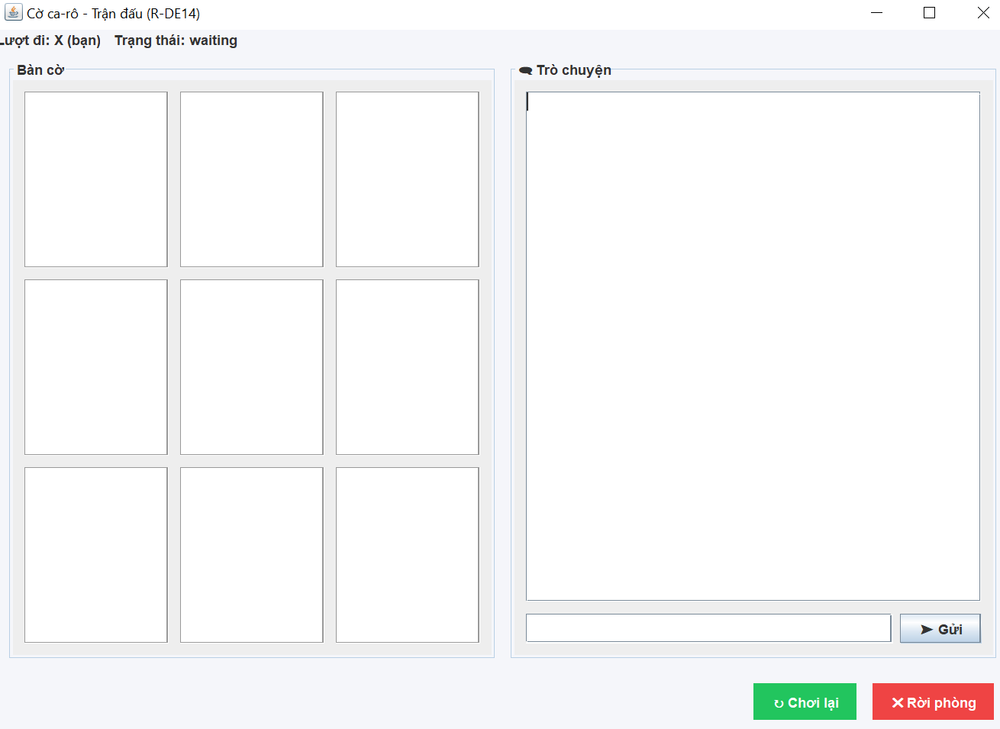
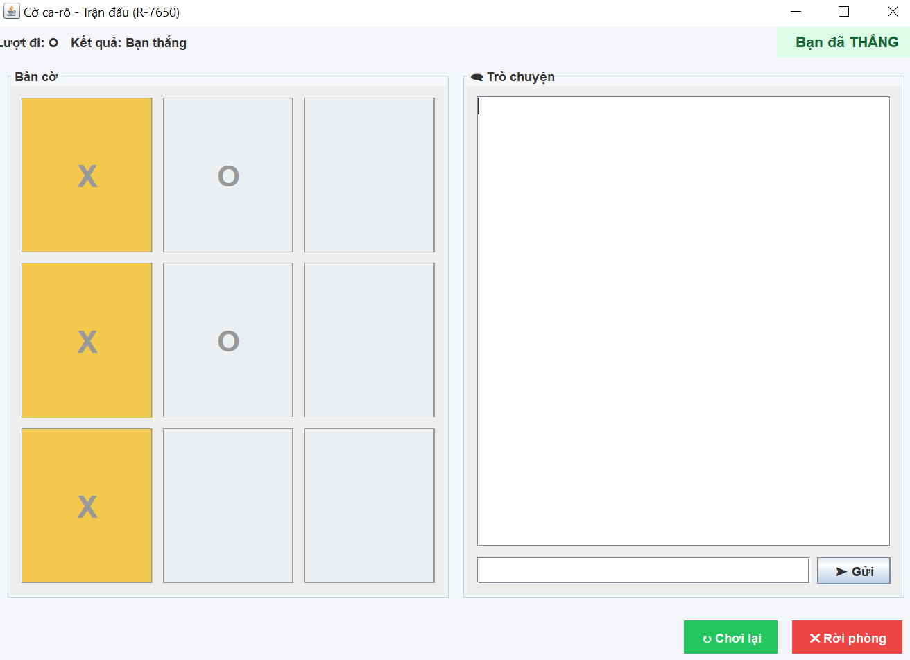

 <h2 align="center">
    <a href="https://dainam.edu.vn/vi/khoa-cong-nghe-thong-tin">
    🎓 Faculty of Information Technology (DaiNam University)
    </a>
</h2>
<h2 align="center">
   GAME TIC TAC TOE (CARO 3x3) SỬ DỤNG GIAO THỨC TCP
</h2>
<div align="center">
    <p align="center">
        
        
        
    </p>

[](https://www.facebook.com/DNUAIoTLab)
[](https://dainam.edu.vn/vi/khoa-cong-nghe-thong-tin)
[](https://dainam.edu.vn)


</div>

## 💡1. Tổng quan về hệ thống
Ứng dụng "Game Caro 3x3" là phiên bản trò chơi cờ Caro cổ điển với bàn cờ 3x3. Người chơi có thể tham gia, tạo phòng và thi đấu trực tuyến với nhau.

Hệ thống được xây dựng theo mô hình client–server và giao tiếp thông qua giao thức TCP, giúp quá trình chơi diễn ra ổn định, mượt mà và đáng tin cậy.

### 💻 Thành phần chính
Ứng dụng gồm các thành phần chính sau:
- **ServerMain**: Khởi động server, mở `ServerSocket` tại cổng 5555, dùng thread pool xử lý nhiều client đồng thời.  
- **Handler**: Xử lý từng client, đọc/gửi dữ liệu qua socket và gọi Core để xử lý logic.  
- **Core**: Bộ não của hệ thống – quản lý người dùng, token, phòng, bàn cờ, chat, lịch sử và bảng xếp hạng.  
- **Store**: Lưu trữ dữ liệu người dùng và sự kiện (users, trận đấu, chat) trong file text (`users.txt`, `events.txt`).  
- **ClientMain**: Điểm vào ứng dụng client, tạo kết nối tới server và mở giao diện Swing.  
- **Net**: Lớp giao tiếp mạng cho client, gửi/nhận request–response dạng text qua TCP.  
- **UI (Swing)**: Các màn hình đăng nhập, lobby, bàn chơi, chat – giao tiếp với `Net` để hiển thị và cập nhật dữ liệu.  
---

### 🌐 Giao thức & Kết nối
- **Kết nối**: Client và Server giao tiếp qua TCP cổng 5555.  
- **Dữ liệu truyền**: dạng văn bản (text), mã hóa UTF-8, mỗi yêu cầu/trả lời là một dòng.  

### Cấu trúc trao đổi  
- **Client gửi**: yêu cầu có id, lệnh (cmd), token (sau khi đăng nhập) và các tham số.  
- **Server trả về**: kết quả với trạng thái OK hoặc ERR, kèm dữ liệu tương ứng.  

### Các lệnh chính  
- **Tài khoản**: Đăng ký, đăng nhập.  
- **Phòng chơi**: Tạo phòng, tham gia, ghép nhanh, rời phòng.  
- **Trạng thái**: Sẵn sàng, huỷ sẵn sàng, lấy thông tin phòng/bàn cờ.  
- **Trò chơi**: Gửi nước đi, cập nhật bàn cờ, xác định thắng/thua/hòa.  
- **Chat**: Gửi và xem lại tin nhắn trong phòng.  
- **Thống kê**: Lịch sử đấu, bảng xếp hạng.  
- **Replay**: Đề nghị, chấp nhận hoặc từ chối chơi lại.  

---

### 💾 Lưu trữ dữ liệu

- Server lưu trữ **tạm thời trong bộ nhớ** (in-memory).  
- Thành phần chính:  
  - **Rooms**: chứa bàn cờ 3x3, danh sách người chơi, lượt hiện tại, trạng thái trận.  
  - **LobbyClients**: danh sách client chưa tham gia phòng.  
- Dữ liệu **không lưu vĩnh viễn**, sẽ mất khi server tắt.  

---

### ♟️ Luật chơi (Tóm tắt)

- Bàn cờ **3x3**, hai người chơi lần lượt đánh dấu `X` và `O`.  
- Người thắng là người có **3 ký hiệu liên tiếp** (hàng ngang, hàng dọc hoặc chéo).  
- Nếu bàn cờ đầy mà **không ai thắng** → ván đấu hòa.  
- Sau khi kết thúc, người chơi có thể chọn **Chơi lại** hoặc **Rời phòng**.  

## 🔧 2. Công nghệ sử dụng
[](https://www.oracle.com/java/)
[](https://adoptium.net/)
[](https://www.java.com/)
[](https://en.wikipedia.org/wiki/Transmission_Control_Protocol)
[](https://docs.oracle.com/en/java/)
[](https://docs.oracle.com/en/java/)

- **Ngôn ngữ lập trình:** Java  
- **Giao diện người dùng:** Java Swing (JFrame, JPanel, JButton, ...).  
- **Mạng & Giao tiếp:** TCP Socket (Client - Server).  
- **Xử lý đa luồng:** Thread để quản lý nhiều client kết nối cùng lúc.  
- **Cấu trúc dự án:** Tách riêng các thành phần `Client`, `Server`, và `UI` để dễ bảo trì và mở rộng.  


## 📸 3. Hình ảnh các chức năng

###  Giao diện Đăng nhập
<p align="center">
  
  <br>
 <em> Hình 1: Giao diện Đăng nhập </em>
</p>

###  Giao diện Đăng ký
<p align="center">
  
  <br>
 <em> Hình 2: Giao diện Đăng ký </em>
</p>

###  Giao diện Lobby
<p align="center">
  
  <br>
<em> Hình 3: Giao diện Lobby </em>
</p>

###  Giao diện Lịch sử đấu
<p align="center">
  
  <br>
<em> Hình 4: Giao diện Lịch sử đấu </em>
</p>

###  Giao diện Bảng xếp hạng
<p align="center">
  
  <br>
<em> Hình 5: Giao diện Bảng xếp hạng </em>
</p>

###  Giao diện bàn cờ và khung chat
<p align="center">
 
  <br>
<em> Hình 6: Giao diện bàn cờ và khung chat </em>
</p>

###  Giao diện chiến thắng
<p align="center">
 
  <br>
<em> Hình 7: Giao diện chiến thắng </em>
</p>

## ⚙️ 4. Các bước cài đặt & Chạy ứng dụng

### 🛠️ 4.1. Yêu cầu hệ thống

* **Java Development Kit (JDK):** Phiên bản **Java 9 trở lên** (khuyến nghị **Java 17 LTS**).
    * *Lưu ý:* Dự án sử dụng `module-info.java`, do đó cần JDK 9+ để biên dịch và chạy.
* **Môi trường phát triển:** Eclipse IDE.
* **Hệ điều hành:** Windows, macOS, hoặc Linux.

---

### 📥 4.2. Thiết lập dự án trong Eclipse

1.  **Mở Eclipse và Import dự án:**
    * Mở Eclipse IDE.
    * Trên thanh menu, chọn **File > Import...**
    * Trong cửa sổ mới, chọn **General > Existing Projects into Workspace** rồi nhấn **Next**.
    * Chọn **Browse...** để tìm đến thư mục gốc của dự án và nhấn **Finish**.

2.  **Kiểm tra cấu hình JDK:**
    * Đảm bảo dự án đã được cấu hình với **JDK 9 trở lên**.
    * Nhấp chuột phải vào dự án trong **Package Explorer**, chọn **Properties**.
    * Kiểm tra trong mục **Java Build Path** hoặc **Java Compiler** để đảm bảo đúng phiên bản JDK được sử dụng.

---

### 4.3 Chạy ứng dụng

### Bước 1: Khởi động Server
- Mở **Eclipse** hoặc terminal.
- Chạy file `ServerMain.java` để khởi tạo server.
- Server sẽ lắng nghe trên **cổng 5555**.
- Khi server chạy thành công, console sẽ hiển thị thông báo:
  ```
  [Server] Listening on port 5555
  ```

### Bước 2: Khởi động Client
- Chạy file `ClientMain.java`.
- Client sẽ tự động kết nối đến server với địa chỉ **127.0.0.1:5555**.
- Giao diện đăng nhập (LoginView) sẽ được mở ra.

### Bước 3: Đăng ký hoặc Đăng nhập
- Người dùng có thể chọn:
  - **Đăng ký (REGISTER)**: tạo tài khoản mới.
  - **Đăng nhập (LOGIN)**: sử dụng tài khoản đã có.

### Bước 4: Tương tác
- Sau khi đăng nhập thành công, người dùng có thể:
  - Tạo phòng, tham gia phòng chơi.
  - Gửi tin nhắn chat đến server, server sẽ lưu lại lịch sử chat.
  - Thực hiện các thao tác game (MOVE, READY, LEAVE…).

---

### 📞 5. Liên hệ
- 👨‍🎓 **Sinh viên thực hiện**: Nguyễn Đào Phúc Nguyên
- 🎓 **Khoa**: Công nghệ thông tin – Đại học Đại Nam
- 📧 **Email**: nguyendaophucnguyen13@gmail.com


